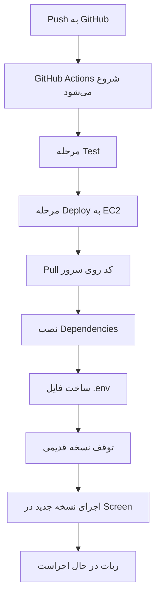

# 🚀 راهنمای کامل گردش کار Deployment - از Push تا اجرای ربات

## سرور مقصد: EC2 آمازون (52.23.157.88)

---

## 📋 نمای کلی فرآیند



---

## 🔍 مرحله ۱: Push کردن کد

### دستور Push:
```bash
cd /workspace
git add .
git commit -m "توضیحات تغییرات"
git push origin main
```

یا استفاده از اسکریپت آماده:
```bash
./PUSH_TO_GITHUB.sh
```

### چه اتفاقی می‌افتد:
- ✅ کد شما به ریپازیتوری GitHub ارسال می‌شود
- ✅ GitHub به صورت خودکار workflow را تشخیص می‌دهد
- ✅ فرآیند CI/CD شروع می‌شود

---

## ⚙️ مرحله ۲: GitHub Actions - شروع Pipeline

### فایل مسئول: `.github/workflows/deploy.yml`

#### Triggerها:
- Push به branchهای `main` یا `master`
- اجرای دستی از تب Actions

#### مراحل اجرایی:

### ۲.۱ Checkout Code
```yaml
uses: actions/checkout@v4
```
- کد شما از GitHub دانلود می‌شود

### ۲.۲ Setup SSH Key
```bash
mkdir -p ~/.ssh
echo "${{ secrets.SSH_PRIVATE_KEY }}" > ~/.ssh/ec2_key.pem
chmod 600 ~/.ssh/ec2_key.pem
ssh-keyscan -H ${{ secrets.EC2_HOST }} >> ~/.ssh/known_hosts
```
- کلید SSH از GitHub Secrets خوانده می‌شود
- برای اتصال به EC2 آماده می‌شود

---

## 🚀 مرحله ۳: Deploy به EC2 (52.23.157.88)

### ۳.۱ اتصال به سرور
```bash
ssh -i ~/.ssh/ec2_key.pem ec2-user@52.23.157.88
```

### ۳.۲ نصب پیش‌نیازهای سیستم
```bash
# اگر git نصب نیست
sudo dnf install -y git || sudo yum install -y git
```

### ۳.۳ Clone یا Update پروژه
```bash
cd /home/ec2-user

if [ -d "agent" ]; then
  # پوشه وجود دارد - update
  cd agent
  git pull origin main
else
  # پوشه وجود ندارد - clone
  git clone https://github.com/ahmadreza0012/agent.git
  cd agent
fi
```

**خروجی مورد انتظار:**
```
📁 Agent directory exists. Updating...
remote: Enumerating objects: 15, done.
remote: Counting objects: 100% (15/15), done.
Receiving objects: 100% (15/15), 4.32 KiB | 1.08 MiB/s, done.
```

### ۳.۴ نصب Dependencies پایتون
```bash
pip3 install -r requirements.txt
```

**خروجی مورد انتظار:**
```
📦 Installing Python dependencies...
Requirement already satisfied: numpy in ./venv/lib/python3.9/site-packages (1.24.3)
Collecting pandas==2.0.3
  Downloading pandas-2.0.3-cp39-cp39-manylinux_2_17_x86_64.manylinux2014_x86_64.whl (12.3 MB)
Installing collected packages: pandas, requests, scikit-learn
Successfully installed pandas-2.0.3 requests-2.31.0 scikit-learn-1.3.0
```

### ۳.۵ ساخت فایل .env
```bash
if [ ! -f .env ]; then
  cp .env.example .env
  echo "⚠️ IMPORTANT: Please update .env file with your API keys!"
fi
```

**نکته مهم:** فایل `.env` فقط بار اول ساخته می‌شود و در آپدیت‌های بعدی حفظ می‌گردد.

### ۳.۶ توقف نسخه قدیمی
```bash
# توقف screen session قبلی
screen -S bot -X quit || true

# یا کشتن processهای python
pkill -f "python.*main.py" || true
```

**خروجی مورد انتظار:**
```
🛑 Stopping existing bot (if running)...
```

### ۳.۷ اجرای نسخه جدید
```bash
screen -S bot -dm bash -c "cd /home/ec2-user/agent && python3 main.py"
```

**توضیح:** 
- `screen -S bot`: ایجاد session با نام "bot"
- `-dm`: اجرای detached (در پس‌زمینه)
- `python3 main.py`: اجرای ربات

**خروجی مورد انتظار:**
```
🚀 Starting bot in screen session...
Screen session created: bot
```

---

## ✅ مرحله ۴: Verification

```bash
cd /home/ec2-user/agent
if [ -f main.py ]; then
  echo "✅ main.py found"
  echo "✅ Project files: $(ls -la | wc -l) files"
else
  echo "❌ Verification failed"
  exit 1
fi
```

---

## 🧹 مرحله ۵: Cleanup

```bash
rm -f ~/.ssh/ec2_key.pem
echo "🧹 Cleanup completed"
```
- کلید SSH موقت پاک می‌شود

---

## 📊 مشاهده وضعیت نهایی

### از طریق GitHub Actions:
```
=========================================
✅ Deployment completed successfully!
=========================================

📊 Bot Status:
There are screens on:
        12345.bot       (Detached)

📝 To view bot logs:
   ssh -i ~/.ssh/ec2_key.pem ec2-user@52.23.157.88
   screen -r bot

📝 To detach from screen: Ctrl+A, then D
```

---

## 🔍 دسترسی به لاگ‌های ربات

### روش ۱: اتصال مستقیم به سرور

```bash
# اتصال به سرور
ssh -i /path/to/agentkey.pem ec2-user@52.23.157.88

# رفتن به پوشه پروژه
cd /home/ec2-user/agent

# اتصال به screen session
screen -r bot
```

**خروجی زنده ربات:**
```
2024-01-15 10:30:45 - INFO - Crypto Portfolio System v5 starting...
2024-01-15 10:30:46 - INFO - Database initialized successfully
2024-01-15 10:30:47 - INFO - Fetching market data...
2024-01-15 10:30:48 - INFO - Detected regime: neutral
2024-01-15 10:30:49 - INFO - Sentiment score: 0.65 (bullish)
2024-01-15 10:30:50 - INFO - Running portfolio optimization...
2024-01-15 10:30:52 - INFO - Optimal weights: BTC=0.35, ETH=0.25, CASH=0.40
2024-01-15 10:30:53 - INFO - Executing trades...
2024-01-15 10:31:00 - INFO - Cycle completed. Waiting for next cycle...
```

### روش ۲:_detach کردن از screen_
```
Ctrl+A, سپس D
```

### روش ۳: مشاهده لاگ‌های قدیمی‌تر
اگر از logging به فایل استفاده می‌کنید:
```bash
tail -f /home/ec2-user/agent/logs/trading.log
```

یا مشاهده outputهای screen:
```bash
# لیست screen sessions
screen -ls

# مشاهده لاگ screen (اگر log فعال باشد)
cat /home/ec2-user/.screenlog.0
```

---

## 🎯 خلاصه دستورات کلیدی

| عمل | دستور |
|-----|-------|
| Push به GitHub | `git push origin main` |
| مشاهده وضعیت Deployment | GitHub → Tab Actions |
| اتصال به سرور | `ssh -i agentkey.pem ec2-user@52.23.157.88` |
| مشاهده لاگ زنده | `screen -r bot` |
| خروج از screen | `Ctrl+A, D` |
| لیست screen‌ها | `screen -ls` |
| حذف screen قدیمی | `screen -S bot -X quit` |
| مشاهده processها | `ps aux \| grep python` |

---

## ⚠️ عیب‌یابی

### مشکل: Deployment شکست خورد
```bash
# 1. بررسی لاگ GitHub Actions
# به tab Actions در GitHub بروید

# 2. اتصال دستی به سرور
ssh -i agentkey.pem ec2-user@52.23.157.88

# 3. بررسی وضعیت git
cd /home/ec2-user/agent
git status
git log --oneline -5

# 4. pull دستی
git pull origin main
```

### مشکل: ربات اجرا نمی‌شود
```bash
# 1. بررسی processها
ps aux | grep python

# 2. اجرای دستی برای مشاهده خطا
cd /home/ec2-user/agent
source venv/bin/activate  # اگر virtualenv دارید
python3 main.py

# 3. بررسی فایل .env
cat .env
```

### مشکل: Screen پیدا نمی‌شود
```bash
# لیست تمام screen‌ها
screen -ls

# اگر session وجود ندارد، مجدد بسازید
screen -S bot -dm bash -c "cd /home/ec2-user/agent && python3 main.py"
```

---

## 📁 فایل‌های مرتبط در پروژه

| فایل | توضیحات |
|------|---------|
| `.github/workflows/deploy.yml` | Pipeline اصلی CI/CD |
| `PUSH_TO_GITHUB.sh` | اسکریپت سریع push |
| `deploy_to_ec2.sh` | اسکریپت deploy دستی |
| `setup_ec2_server.sh` | آماده‌سازی اولیه سرور |
| `QUICK_START_CI_CD.md` | راهنمای سریع |
| `.github/workflows/README_CI_CD.md` | مستندات کامل CI/CD |

---

## 🔐 Secrets مورد نیاز در GitHub

به آدرس زیر بروید:
```
https://github.com/YOUR_USERNAME/YOUR_REPO/settings/secrets/actions
```

سه Secret اضافه کنید:

| نام | مقدار |
|-----|-------|
| `EC2_HOST` | `52.23.157.88` |
| `EC2_USER` | `ec2-user` |
| `SSH_PRIVATE_KEY` | محتوای کامل فایل `agentkey.pem` |

### دریافت SSH Private Key:
```bash
cat /workspace/agentkey.pem
# کل خروجی را کپی کنید (از BEGIN تا END)
```

---

## 🎉 پس از اتمام موفقیت‌آمیز

1. ✅ کد شما روی سرور 52.23.157.88 deploy شد
2. ✅ Dependencies نصب شدند
3. ✅ ربات در screen session در حال اجراست
4. ✅ می‌توانید با `screen -r bot` لاگ‌ها را ببینید

**زمان تقریبی کل فرآیند:** ۳-۵ دقیقه
