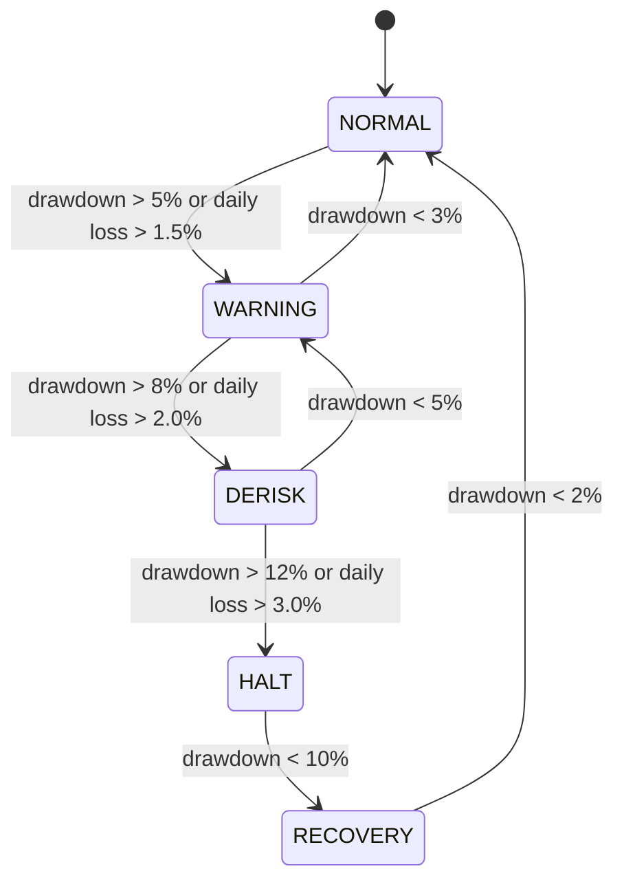

# Risk Management

## Risk Philosophy

The Crypto Trading Agent implements a **defense-in-depth** risk management approach. Multiple independent layers of risk control ensure that no single failure can cause catastrophic loss.

### Core Principles

1. **Capital Preservation**: Protecting capital takes priority over generating returns
2. **Independent Validation**: Risk engine operates independently from strategy logic
3. **Automatic Intervention**: System automatically reduces risk when thresholds breached
4. **Stateful Monitoring**: Risk state persists across system restarts
5. **Transparent Overrides**: All risk interventions are logged and explainable

---

## Risk Engine Architecture

```
┌─────────────────────────────────────────────────────────────┐
│                     RISK ENGINE                             │
├─────────────────────────────────────────────────────────────┤
│                                                             │
│  ┌──────────────┐    ┌──────────────┐    ┌──────────────┐ │
│  │ Risk Limits  │    │ Risk Metrics │    │   Circuit    │ │
│  │              │    │              │    │  Breaker     │ │
│  │ - Exposure   │    │ - Volatility │    │              │ │
│  │ - Position   │    │ - Drawdown   │    │ - State      │ │
│  │ - Daily Loss │    │ - Correlation│    │ - Transitions│ │
│  │ - Drawdown   │    │ - Liquidity  │    │ - Override   │ │
│  └──────────────┘    └──────────────┘    └──────────────┘ │
│         │                   │                    │         │
│         └───────────────────┼────────────────────┘         │
│                             ▼                              │
│                  ┌──────────────────┐                      │
│                  │  Risk Decision   │                      │
│                  │                  │                      │
│                  │ - Allowed        │                      │
│                  │ - Multiplier     │                      │
│                  │ - Max Exposure   │                      │
│                  │ - Reason         │                      │
│                  └──────────────────┘                      │
│                             │                              │
│                             ▼                              │
│                  Override Strategy Weights                 │
│                                                             │
└─────────────────────────────────────────────────────────────┘
```

### Components

| Component | File | Purpose |
|-----------|------|---------|
| Risk Engine | `risk/risk_engine.py` | Centralized risk evaluation |
| Risk Limits | `risk/risk_limits.py` | Configurable limits |
| Risk Metrics | `risk/risk_metrics.py` | Metric calculations |
| Circuit Breaker | `risk/circuit_breaker.py` | State machine for automatic intervention |

---

## Risk Metrics

### Portfolio-Level Metrics

| Metric | Formula | Limit |
|--------|---------|-------|
| Gross Exposure | Σ\|weights\| | ≤ 60% |
| Net Exposure | Σ weights | ±40% |
| Portfolio Volatility | √(w'Σw) | ≤ 20% annualized |
| Maximum Position | max(\|w_i\|) | ≤ 20% |
| Daily VaR (95%) | Historical simulation | ≤ 5% |
| CVaR (90%) | Expected shortfall | ≤ 8% |

### Position-Level Metrics

| Metric | Description | Limit |
|--------|-------------|-------|
| Position Size | Absolute position value | ≤ 20% of portfolio |
| ADV Participation | Order size / daily volume | ≤ 20% |
| Liquidity Score | Volume-weighted liquidity | Must pass threshold |

### Performance Metrics

| Metric | Warning | Critical |
|--------|---------|----------|
| Daily P&L Loss | > 1.5% | > 3.0% |
| Drawdown from Peak | > 5% | > 12% |
| Consecutive Losses | ≥ 3 | ≥ 5 |

---

## Position Sizing

### Default Limits

```python
# From risk_limits.py
DEFAULT_LIMITS = {
    'max_exposure': 0.60,        # 60% gross exposure
    'max_position': 0.20,        # 20% per asset
    'max_daily_loss': 0.03,      # 3% daily loss limit
    'max_drawdown': 0.12,        # 12% peak drawdown
    'max_leverage': 1.0,         # No leverage
}
```

### Calculation Method

```python
def calculate_position_size(signal_strength, volatility, liquidity):
    """Calculate position size based on multiple factors."""
    
    # Base size from signal
    base_size = signal_strength * 0.10  # Max 10% base
    
    # Volatility adjustment (reduce size in high vol)
    vol_adjustment = min(1.0, 0.15 / max(volatility, 0.01))
    
    # Liquidity adjustment (reduce for illiquid assets)
    liq_adjustment = min(1.0, liquidity / 1_000_000)
    
    # Final size
    position_size = base_size * vol_adjustment * liq_adjustment
    
    # Apply hard limits
    position_size = min(position_size, 0.20)  # Max 20%
    
    return position_size
```

---

## Exposure Limits

### By Trading Mode

| Mode | Max Gross | Max Net | Max Single |
|------|-----------|---------|------------|
| Backtest | 60% | 40% | 20% |
| Paper | 60% | 40% | 20% |
| Shadow | 60% | 40% | 20% |
| Live | 60% | 40% | 20% |

### Enforcement

```python
# In risk_engine.py
def check_exposure(self, weights: Dict[str, float]) -> RiskDecision:
    """Check if proposed weights violate exposure limits."""
    
    gross_exposure = sum(abs(w) for w in weights.values())
    net_exposure = sum(weights.values())
    max_single = max(abs(w) for w in weights.values())
    
    if gross_exposure > self.limits.max_exposure:
        return RiskDecision.reduce(
            multiplier=self.limits.max_exposure / gross_exposure,
            reason=f"Gross exposure {gross_exposure:.1%} exceeds limit {self.limits.max_exposure:.1%}"
        )
    
    if max_single > self.limits.max_position:
        return RiskDecision.reduce(
            multiplier=self.limits.max_position / max_single,
            reason=f"Position {max_single:.1%} exceeds limit {self.limits.max_position:.1%}"
        )
    
    return RiskDecision()  # OK
```

---

## Drawdown Controls

### Circuit Breaker State Machine



### State Definitions

| State | Trigger | Position Multiplier | Trading Allowed |
|-------|---------|--------------------|-----------------|
| **NORMAL** | Baseline | 100% | Yes |
| **WARNING** | Drawdown > 5% | 70% | Yes (reduced) |
| **DERISK** | Drawdown > 8% | 40% | Yes (minimal) |
| **HALT** | Drawdown > 12% | 0% | No |
| **RECOVERY** | Drawdown < 10% | 50% | Yes (gradual) |

### Implementation

```python
# From circuit_breaker.py
class BreakerState(Enum):
    NORMAL = "normal"
    WARNING = "warning"
    DERISK = "derisk"
    HALT = "halt"
    RECOVERY = "recovery"

    @property
    def multiplier(self) -> float:
        return {
            BreakerState.NORMAL: 1.0,
            BreakerState.WARNING: 0.7,
            BreakerState.DERISK: 0.4,
            BreakerState.HALT: 0.0,
            BreakerState.RECOVERY: 0.5,
        }[self]
```

---

## Risk Override Mechanism

### Decision Types

```python
@dataclass
class RiskDecision:
    allowed: bool = True           # Can trading proceed?
    risk_multiplier: float = 1.0   # Scale factor for positions
    max_exposure: float = 1.0      # Maximum gross exposure
    max_position: float = 0.20     # Maximum single position
    reason: str = "OK"             # Human-readable explanation
    details: Dict[str, Any] = field(default_factory=dict)
    
    @classmethod
    def halt(cls, reason: str) -> 'RiskDecision':
        """Create a HALT decision."""
        return cls(allowed=False, risk_multiplier=0.0, reason=f"HALT: {reason}")
    
    @classmethod
    def reduce(cls, multiplier: float, reason: str) -> 'RiskDecision':
        """Create a REDUCE decision."""
        return cls(allowed=True, risk_multiplier=multiplier, reason=f"REDUCE: {reason}")
```

### Override Flow

```
Strategy Weights → Risk Check → Circuit Breaker → Final Weights
                        ↓              ↓
                   If fails       If triggered
                        ↓              ↓
                   Reduce/Halt    Apply Multiplier
```

---

## Stress Testing

### Built-in Scenarios

The system includes stress testing capabilities:

1. **Historical Stress**: Replay historical crisis periods
2. **Monte Carlo**: Random sampling of returns distribution
3. **Sensitivity Analysis**: Parameter perturbation testing

### Configuration

```yaml
stress_testing:
  scenarios:
    - name: "crypto_winter"
      period: "2022-01-01 to 2022-12-31"
    - name: "covid_crash"
      period: "2020-02-01 to 2020-04-30"
  
  monte_carlo:
    n_simulations: 1000
    horizon_days: 30
    confidence_level: 0.95
```

---

## Monte Carlo Analysis

### Purpose

Assess strategy robustness by simulating thousands of possible return paths.

### Method

```python
def monte_carlo_analysis(returns: np.ndarray, n_sims: int = 1000) -> Dict:
    """Run Monte Carlo simulation on historical returns."""
    
    results = []
    for _ in range(n_sims):
        # Sample returns with replacement
        sampled = np.random.choice(returns, size=len(returns), replace=True)
        
        # Calculate cumulative returns
        cum_returns = np.cumprod(1 + sampled) - 1
        
        # Record metrics
        results.append({
            'final_return': cum_returns[-1],
            'max_drawdown': np.min(np.minimum.accumulate(cum_returns) - cum_returns),
            'volatility': np.std(sampled) * np.sqrt(252)
        })
    
    return {
        'expected_return': np.mean([r['final_return'] for r in results]),
        'var_95': np.percentile([r['final_return'] for r in results], 5),
        'expected_shortfall': np.mean([r['final_return'] for r in results if r['final_return'] < np.percentile([r['final_return'] for r in results], 5)]),
        'probability_of_ruin': np.mean([r['max_drawdown'] < -1.0 for r in results])
    }
```

---

## Configuration Parameters

### Environment Variables

```bash
# Risk Limits
TRADING_LIMITS__MAX_DAILY_LOSS=0.05
TRADING_LIMITS__MAX_TOTAL_DRAWDOWN=0.15
TRADING_LIMITS__MAX_POSITION_SIZE=0.20
TRADING_LIMITS__MAX_EXPOSURE=0.60
TRADING_LIMITS__MAX_LEVERAGE=1.0

# Circuit Breaker
TRADING_SAFETY__KILL_SWITCH_ENABLED=true
TRADING_SAFETY__AUTO_DERISK=true
TRADING_SAFETY__HALT_ON_DISCREPANCY=true
TRADING_SAFETY__MAX_API_FAILURES=3
```

### Programmatic Configuration

```python
from risk.risk_limits import RiskLimits

# Custom limits for conservative mode
conservative_limits = RiskLimits(
    max_exposure=0.40,
    max_position=0.10,
    max_daily_loss=0.02,
    max_drawdown=0.08,
    max_leverage=1.0
)

# Pass to risk engine
risk_engine = RiskEngine(limits=conservative_limits, mode='live')
```

---

## Troubleshooting

### Circuit Breaker Triggered Unexpectedly

**Symptoms**: Trading halted despite no obvious issues.

**Diagnosis**:
```bash
# Check circuit breaker state
grep "CIRCUIT_BREAKER" logs/*.log

# Check recent drawdown
grep "drawdown" logs/*.log | tail -20
```

**Resolution**:
1. Review drawdown calculation
2. Verify peak tracking is correct
3. Adjust thresholds if too conservative
4. Restart with `NORMAL` state if false positive

### Risk Engine Rejecting All Trades

**Symptoms**: No trades executed despite valid signals.

**Diagnosis**:
```bash
# Check risk decisions
grep "RiskDecision" logs/*.log | tail -20
```

**Common Causes**:
- Exposure limit too low for signal strength
- Volatility estimate too high
- Liquidity filter too strict

**Resolution**:
1. Review risk decision reasons
2. Adjust limits appropriately
3. Verify input data quality

---

## Best Practices

1. **Set limits conservatively** - Better to miss opportunities than lose capital
2. **Monitor circuit breaker state** - Check daily
3. **Review risk decisions** - Understand why trades were modified/blocked
4. **Test in paper mode** - Validate risk settings before live
5. **Document overrides** - Keep record of manual interventions
6. **Regular stress tests** - Run monthly at minimum
7. **Update limits gradually** - Small changes, monitor impact

---

## Version Information

- **Document Version**: 1.0
- **Last Updated**: 2024
- **Phase**: 35 (Documentation)

---

*This document reflects the actual implementation as of Phase 35.*
